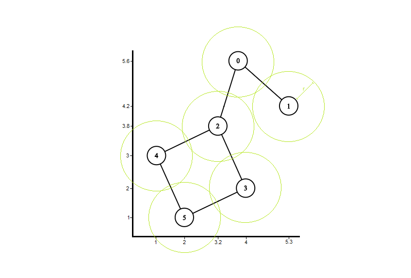

# Locally Sensitive Data Mule Scheduling Problem (W.I.P.)

Ongoing research project on data management and information retrieval within sensor networks under locally sensitive topology restrictions.

## Explored/Proposed methods

### Greedy
### Convex-Hull
### Alpha-Shape

The <span>&#x3B1;</span>-hull of a set of points *P* is the intersection of all closed discs with radius *1/<span>&#x3B1;</span>* that contains all the points of *P*. A point *p* &isin; *P* is called an *<span>&#x3B1;</span>-extreme* in *P* if there exists a closed generalized disc of radius *1/<span>&#x3B1;</span>*, such that *p* lies on its boundary and it contains all the points of *P*. If, for two *<span>&#x3B1;</span>-extreme* points *p$* and *q*, there exists a closed generalized disc of radius *1/<span>&#x3B1;</span>* with both points on its boundary and which contains all other points, then *p* and *q* are called *<span>&#x3B1;</span>-neighbors*. Thus, the *<span>&#x3B1;</span>-shape* of *P* is defined as the graph whose vertices are the *<span>&#x3B1;</span>-extreme* points and whose edges connect the respective *<span>&#x3B1;</span>-neighbors* [1].

It is easy to see that, as *<span>&#x3B1;</span>* approaches 0, the <span>&#x3B1;</span>-shape approaches the common convex-hull.

## Instances

The instances utilized here come follows the following structure: the first line of the file gives out the **total number of nodes** within the network (modeled as a graph) as well as the sensor's communication range **radius**, followed by the sensors **coordinates** *(x, y)* separated from their respective **neighbors list** by an empty line (the first value corresponds to the total number of neighbors). An example of such instances is shown bellow, followed by its visual representation.

```cpp
6 r
4 5.6
5.3 4.2
3.2 3.8
4 2
1 3
2 1

2 1 2
1 0
3 0 3 4
2 2 5
2 2 5
2 3 4
```


This work considers the case where all the sensors within the network have the same communication area. Sensor nodes *p* and *q* are said to be neighbors (e.g. vertices have an edge connecting them) if their communication range overlap.

## Results

- [With Acks](https://github.com/Willian-Girao/locally_sensitive_dmsp/blob/master/alpha_shape_2D/solver/Results/README.md)
- Without Acks

## References

1. [H. Edelsbrunner, D.K., Seidel, R., 1983. On the shape of a set of pointsin the plane. IEEE Transactions on      Information Theory 29, 551 – 559.](https://www.semanticscholar.org/paper/The-Shape-of-a-Set-of-Points-in-the-Plane-Edelsbrunner-Kirkpatrick/73942f26c21dbf6e572b31dcd070d357fc91b356)